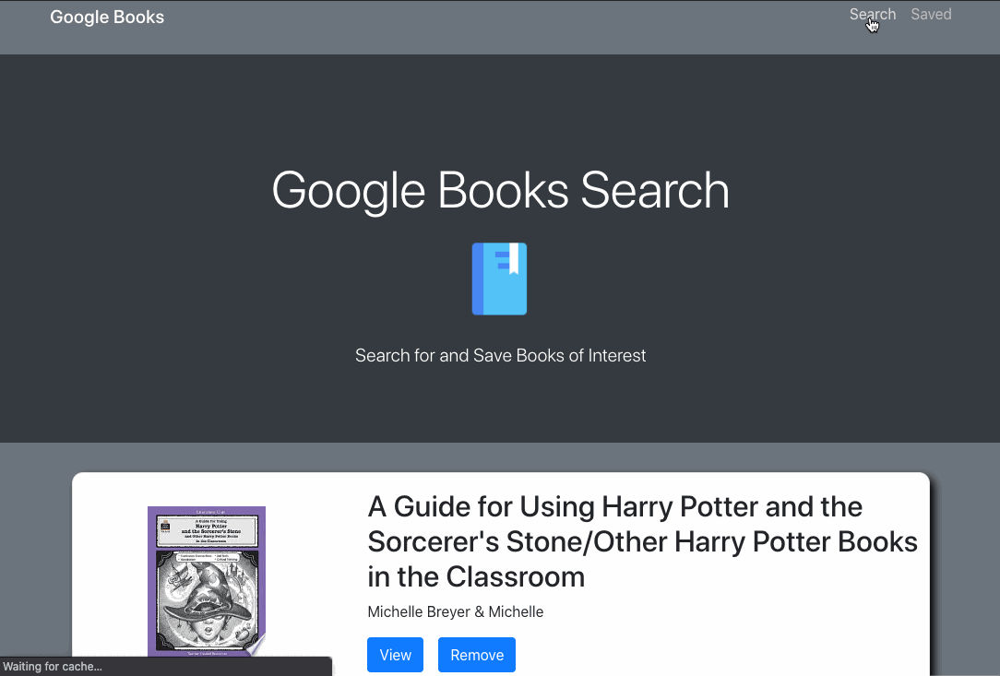

# Google Books Search & Save


[](https://www.mit.edu/~amini/LICENSE.md)

## Table of Contents
* [Description](#Description)
* [GIFs of Project](#gifs-of-project)
* [Repository Link](#repository-link)
* [Deployed Link](#deployed-link)
* [Technologies Used](#Technologies-Used)
* [Authors](#Authors)
* [Credits](#Credits)

<br>
<hr>
<br>


## Description 

Welcome to our Google Books Application using React! In this project, we made a full stack application using MongoDB, Express, React JS and Node JS. When the user opens the application, the user will see the homepage/search page that has a search input field and a "Search Books" button. The user is able to type into the search input field and each letter change is being tracked and we can now grab that search value made by the user. Once the user clicks on the seach button, the user will be displayed with results of books that contain the word/phrase/title/author they typed in. If there are no books with that word/title, the user will be displayed a container that lets the user know that no matches were found. We are grabbing information about these books using an axios call to the Google Books API and we've chosen specific data we'd like to display which includes the following: title, author, description, "View" button and a "Save Book" button. When the user clicks on the "View" button, the user will be taken into a new window/tab in their browser that pertains to the book with more details on Google and the user can purchase the book they want. When the user clicks on the "Save Book" button, these books will be saved into a database we've set up using MongoDB and can now be viewed in the Saved page with all the saved books by the user. Clicking the "Save Book" button sends a response back to the user that "the book has been saved" with a modal pop up we've set up. If the book already exists in the database but the user clicked on the save button again on that same book, the user will be displayed with the message "the book already has been saved". We keep track of this by comparing the IDs of the books and refrain from any repeats into the database. In the saved page, the user can see all the books they've saved in that page for their review. The user again is given two options, a "View" button that again sends the user to Google with more information on the book and can choose to purchase the book and a "Remove" button if they no longer want the book in there. 


In this project, our team worked smoothly than expected to accomplish the output. It was a collaborative effort and was able to get most of the work done in a day and then some troubleshooting, styling fixes, etc. towards the end. There weren't many merge conflicts because we are able to openly communicate and review changes meticulously that code doesn't get lost. We spend hours together on call to be able to effectively communicate on things.

<br>
<hr>
<br>

## GIFs of Project

Here's a GIF of the application.



Here is a GIF of our mobile application. 


<br>
<hr>
<br>

## Repository Link
* [GitHub Repository](https://github.com/janessaref/google-books-search)

<br>
<hr>
<br>

## Deployed Link
* [See Live Site](https://googlelibrary-search.herokuapp.com/)

<br>
<hr>
<br>

## Technologies Used
* [react](https://reactjs.org/)
* [axios](https://www.npmjs.com/package/axios)
* [express](https://www.npmjs.com/package/express)
* [if-env](https://www.npmjs.com/package/if-env)
* [mongoose](https://mongoosejs.com/)
* [react-router-dom](https://reactrouter.com/)
* [MongoDB](https://www.mongodb.com/)
* [react-router-dom](https://nodejs.org/en/)

<br>
<hr>
<br>


## Code
* "saveBook" function handles the error checking when a book does not have an image it send the google book logo instead. This function also handles error checking for saving the same book, it uses a model to send a message of either "was saved" if the book was successfully saved or "is already saved" if the book is aleady in the database. 
```
    const saveBook = (book) => {
        var image;
        if (book.volumeInfo.imageLinks === undefined) {
            image = "./googlebookslogo.png"
        } else {
            image = book.volumeInfo.imageLinks.thumbnail
        };
    
        if (!ids.includes(book.id)) {
            setIds([...ids, book.id]);
            setModalClass("modal showModal");
            setText(book.volumeInfo.title + " was saved!");
        } else {
            setModalClass("modal showModal");
            setText(book.volumeInfo.title + " is already saved!");
        };
```

* This function is used to make an api call to our data base and get all the saved books, and with use effect it set's the "books" state to the response of the api call. 
```
    useEffect(() => {
        APIbooks.getApiBooks()
        .then(res=>setBooks(res.data))
        // console.log(books)
        }, [books]);
```

<br>
<hr>
<br>

## Authors 
<br>

Jerri Fong
<br>

[](https://github.com/janessaref)
<br>

[](https://linkedin.com/in/janessafong)

<br>

Josh Glugatch
<br>

[](https://github.com/joshglugatch)
<br>

[](www.linkedin.com/in/joshua-glugatch)

<br>

Jon SanPedro
<br>

[](https://github.com/jsp117)
<br>

[](https://www.linkedin.com/in/jonathansanpedro/)

<br>

Ivan Torres
<br>

[](https://github.com/IvanTorresMia)
<br>

[](www.linkedin.com/in/ivan-torres-0828931b2)

<br>
<hr>
<br>

## Credits
* [StackOverFlow](https://stackoverflow.com/)

